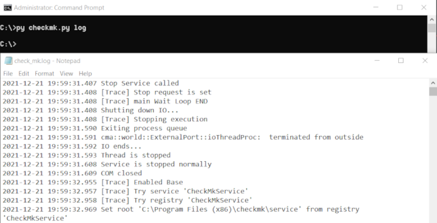

# checkmk agent companion
This program eases the life of sysadmins by providing features to troubleshoot the [checkmk agent for Windows]. Linux support will be added later. (**[checkmk]** is an open source infrastructure monitoring tool.)

<p></p>


## Features

- Get the agent version
- Reload the agent configuration
- Restart the checkmk agent service
- Show the output of an agent test
- Open the agent log file
- Filter the agent log on errors/warnings
- Show the running agent config
- Show the stored configs (default, bakery, or user)
- Lookup the value of a specific config setting

## Requirements

### Python version

checmk.py is written in Python 3. Currently 3.10 is the only tested version.

### pywin32

On Windows systems, this program requires pywin32.

<details><summary><b>Show instructions</b></summary>

Install it via pip:
```
pip install pywin32 --upgrade
```
or alternatively, get [pywin32] from GitHub.

</details>

## Usage

```
checkmk.py [-h] [-v] [-q] [-c {all,default,bakery,user}]
                  [-s {all,fileinfo,global,local,logfiles,logwatch,mrpe,plugins,ps,spool,system,winperf}]
                  [-? QUESTION] [-e] [-o] [-n-o]
                  {version,reload,restart,test,config,log}
```

### Options
When calling `checkmk.py`, the following flags are available:

- `-h, --help`
  - show the help message and exit
- `-v, --verbose`
  - increase output verbosity for debugging purposes
- `-q, --quiet`
  - don't print any output
- `action {version,reload,restart,test,config,log}`
  - action to perform: the main features of the program
- `-c, --config {all,default,bakery,user}`
  - the config to display. 'all' returns the (merged) running config
  - specify which of the [agent’s configuration files] should be retrieved
- `-s, --section {all,fileinfo,global,local,logfiles,logwatch,mrpe,plugins,ps,spool,system,winperf}`
  - set config scope
  - cannot be combined with `--config`
- `-?, --question QUESTION`
  - setting to return (only applicable to the config-action)
- `-e,  --byexception`
  - only display warning and critical log messages (only applicable to the log-action)              
- `-o, --open`
  - open saved data in a text viewer (supported by the following actions: test, config, log)
  - defaults to True, which can be overwritten with the 'no-open' flag
- `-n-o, --no-open`
  - only save data without opening it (supported by the following actions: test, config, log)
  - used to overwrite the 'open' flag

## Examples

### Version

```
py checkmk.py version
```
The version-action executes the `check_mk_agent.exe version` command. It retrieves the version number from the returned output. For example, the output "Check_MK Agent version 1.6.0p18" becomes "1.6.0p18".
<p></p>

### Reload

```
py checkmk.py reload
```
The reload-action executes the `check_mk_agent.exe reload_config` command.
<p></p>

### Restart

```
py checkmk.py restart
```
Restarts the 'Check Mk Service'.
<p></p>

### Test

```
py checkmk.py test
```
The test-action executes the `check_mk_agent.exe test` command, writes the output to a text file in the agent log directory, and opens the text file in Notepad (on Windows).
<p></p>

### Config

```
py checkmk.py config
```
The config-action executes the `check_mk_agent.exe showconfig` command, and writes the output - the running config - to a text file in the agent log directory.
<p></p>

### Config - scoped

```
py checkmk.py config -c user
```
The `-c` (or `--config`) argument sets the [agent's configuration files] (default, bakery, or user) to retrieve. Like the default config-action (all), the output is written to a text file and opened.
<p></p>

### Config - section

```
py checkmk.py -config --section mrpe --no-open
```
The `--section` (or `-s`) argument sets the config scope to retrieve. In this case, only the keys within the mrpe section will be retrieved. This only works with the running config ('all'), because it depends on the `check_mk_agent.exe showconfig [section]` command. With the `--no-open` flag set, the text file won't be opened.
<p></p>

### Config - question

```
py checkmk.py config -? encrypted --verbose
```
The `-?` (or `--question`) argument contains a specific key to lookup in the running config, and returns the value (if any). `--verbose` enables additional feedback for troubleshooting purposes.
<p></p>

### Log

```
py checkmk.py log
```
Opens the checkmk agent log file, usually "C:\ProgramData\checkmk\agent\log\check_mk.log".
<p></p>

### Log - by exception

```
py checkmk.py log --byexception
```
Extracts the critical and warning messages from the checkmk agent log file, writes them to a text file in the agent log directory, and opens the text file in Notepad (on Windows). `--byexception` can be aliased with `-e`.
<p></p>


[checkmk]:                      https://checkmk.com/
[checkmk agent for Windows]:    https://docs.checkmk.com/latest/en/agent_windows.html
[agent's configuration files]:  https://docs.checkmk.com/latest/en/agent_windows.html#heading__the_agents_configuration_files
[pywin32]:                      https://github.com/mhammond/pywin32/releases
