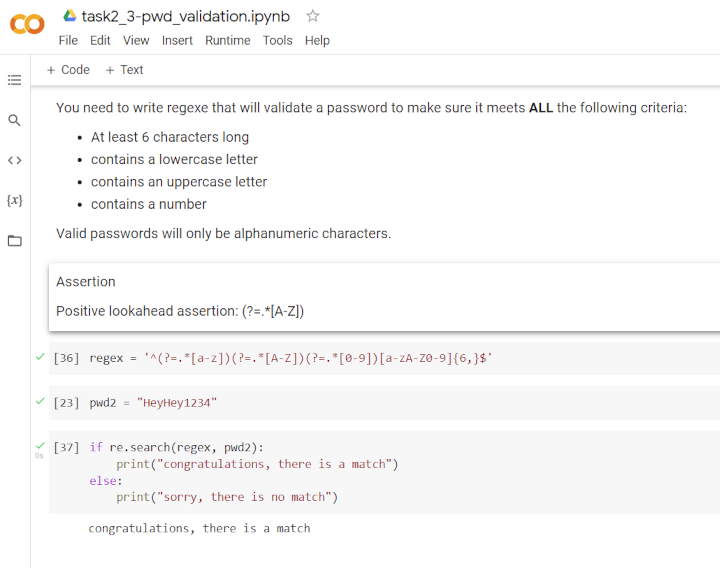

# Regular Expressions in Python

Guided Project: [Regular Expressions in Python] by Coursera Project Network.

The course uses Google's [Colab], or "Colaboratory", which allows you to write and execute Python in your browser.

Content of the guided project:
- [task 1: basic regex]
- [task 2/3: password validation in python]
- [task 4: user input]
- [task 5: greedy/non-greedy]

Example:

[Regular Expressions in Python]: https://www.coursera.org/projects/regular-expressions-in-python
[Colab]: https://colab.research.google.com/
[task 1: basic regex]:                     https://colab.research.google.com/drive/1CrK9tMKROa-E61CE8guJak4QkMnqL2mp?usp=sharing
[task 2/3: password validation in python]: https://colab.research.google.com/drive/1jttQfi0_nlsS4I0w9iCe-1vvLcSGDPmZ?usp=sharing
[task 4: user input]:                      https://colab.research.google.com/drive/1rqP1X4pH7MqmCfIXGSqKok7JjHJtkeFe?usp=sharing
[task 5: greedy/non-greedy]:               https://colab.research.google.com/drive/1d205p8jzDI0KN88xA58CPtJhqLXaPC_u?usp=sharing