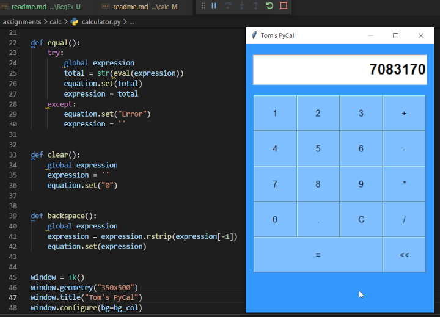

# GUI programming: Create a Calculator in Python

A Guided Project by Coursera Project Network. For more information: [GUI programming: Create a Calculator in Python]

Result:

[GUI programming: Create a Calculator in Python]: https://www.coursera.org/projects/gui-programming-calculator-python